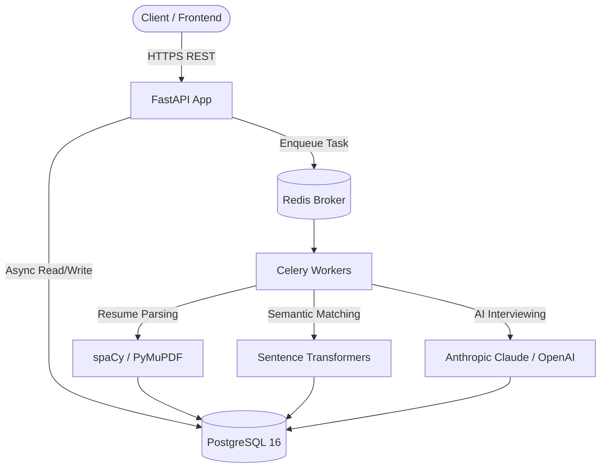

<h1 align="center">AI HR Recruitment Simulator (XG_Backend)</h1>

<p align="center">
  <em>An intelligent, AI-driven backend for automated candidate screening, semantic job matching, and interactive interviews.</em>
</p>

<p align="center">
  
  
  
  
  
  
</p>

---

## 2. Problem Statement

Traditional HR recruitment is plagued by manual resume screening, keyword-based ATS systems that miss semantic context, and unstructured interviews that lead to biased hiring decisions. 

**XG_Backend** solves this by replacing fragile keyword-matching with state-of-the-art NLP, augmenting HR workflows with AI-driven automated interviews, and providing a deterministic, weighted ranking system for unbiased candidate evaluation.

## 3. Solution Overview

**XG_Backend** is a production-grade REST API that orchestrates the entire recruitment pipeline. 

* **Core Idea:** A unified backend that parses resumes via OCR/NLP, scores candidates against job descriptions using dense vector embeddings, and conducts rubric-based AI interviews.
* **Architecture Philosophy:** Asynchronous, event-driven, and highly scalable. Uses FastAPI for non-blocking I/O, Celery for heavy ML tasks, and PostgreSQL for ACID-compliant storage.
* **Unique Selling Points:**
  - Semantic Matching (not just keywords)
  - Interactive LLM-powered Interviews
  - Comprehensive Security (rate limiting, path traversal guards, prompt injection defense)

## 4. Key Features

| Feature | Description | Benefit |
|---------|-------------|---------|
| 📄 **Intelligent Parsing** | Multi-modal resume parsing (PyMuPDF + Tesseract OCR). | Extracts education, experience, and skills accurately, even from scanned PDFs. |
| 🧠 **Semantic Matching** | Sentence-transformers compute cosine similarity between resumes and job posts. | Discovers candidates based on conceptual fit, bypassing keyword stuffing. |
| 🤖 **AI Interviews** | Dynamic, LLM-powered chat interface evaluating specific job rubrics. | Scales initial screening while maintaining consistent evaluation standards. |
| 📊 **Weighted Ranking** | Configurable composite scoring (Resume 30%, Match 30%, Interview 40%). | Data-driven, objective candidate leaderboards for HR. |
| 🛡️ **Enterprise Security** | JWT Auth, Prompt Injection Hardening, Rate Limiting, MIME validation. | Production-ready out of the box, safe from common AI and web vulnerabilities. |

## 5. Architecture



## 6. System Design

* **Frontend:** (External to this repo) Consumes REST APIs.
* **Backend:** FastAPI (Python 3.11) with Pydantic for validation and async endpoints.
* **Database:** PostgreSQL 16 with asyncpg driver and SQLAlchemy 2.0 ORM. Alembic for migrations.
* **AI/ML Layer:** spaCy (`en_core_web_sm`) for NER, HuggingFace `all-MiniLM-L6-v2` for semantic search, and Anthropic/OpenAI APIs for generative text.
* **Authentication:** JWT with short-lived tokens and bcrypt password hashing.
* **External Integrations:** Anthropic Claude API / OpenAI API.

## 7. Technology Stack

### Backend & Core
| Technology | Version | Purpose |
|------------|---------|---------|
| **FastAPI** | 0.111.0 | Core REST framework, async routing |
| **Uvicorn** | 0.29.0 | ASGI web server |
| **Pydantic** | 2.7.1 | Data validation and settings management |

### Database & Caching
| Technology | Version | Purpose |
|------------|---------|---------|
| **PostgreSQL** | 16 | Primary relational database |
| **SQLAlchemy** | 2.0.30 | Async ORM |
| **Redis** | 5.0.4 | Celery message broker |

### AI / ML
| Technology | Version | Purpose |
|------------|---------|---------|
| **spaCy** | 3.7.4 | Named Entity Recognition (NER) |
| **Sentence-Transformers** | 2.7.0 | Dense vector embeddings |
| **PyMuPDF / pdfplumber** | Latest | PDF text extraction |

### DevOps
| Technology | Purpose |
|------------|---------|
| **Docker** | Containerization of API and workers |
| **Docker Compose** | Multi-container orchestration |
| **Celery** | Distributed task queue |

## 8. Project Structure

```text
backend/
├── app/
│   ├── main.py              # FastAPI application, lifespan events, routers
│   ├── ai/                  # Core AI/ML engines (Parser, Matcher, Interviewer)
│   ├── core/                # Configuration, Database Setup, Security
│   ├── models/              # SQLAlchemy Database Models
│   ├── schemas/             # Pydantic DTOs
│   ├── api/v1/              # REST Endpoints
│   ├── services/            # Business Logic Layer
│   ├── tasks/               # Celery Background Tasks
│   └── utils/               # File handlers and helpers
├── tests/                   # Pytest test suites
├── Dockerfile               # API Container spec
├── docker-compose.yml       # Local dev orchestration
└── requirements.txt         # Python dependencies
```

## 9. Installation

### Prerequisites
* Docker & Docker Compose (Recommended)
* Python 3.11+ (For local execution)
* PostgreSQL (For local execution)

### Option A: Docker Setup (Recommended)
1. **Clone the repository:**
   ```bash
   git clone https://github.com/Dolmaa24/XG_Backend.git
   cd XG_Backend
   ```
2. **Configure Environment:**
   ```bash
   cp .env.example .env
   # Edit .env and add your ANTHROPIC_API_KEY or OPENAI_API_KEY
   ```
3. **Start Services:**
   ```bash
   docker compose up --build
   ```
   *API available at `http://localhost:8000/docs`*

### Option B: Local Setup
1. **Virtual Environment:**
   ```bash
   python -m venv venv
   source venv/bin/activate
   ```
2. **Install Dependencies:**
   ```bash
   pip install -r requirements.txt
   python -m spacy download en_core_web_sm
   ```
3. **Run Server:**
   ```bash
   uvicorn app.main:app --reload --port 8000
   ```
4. **Run Celery Worker (Separate Terminal):**
   ```bash
   celery -A app.tasks.celery_tasks.celery_app worker --loglevel=info
   ```

## 10. API Documentation

Full interactive documentation is available via Swagger UI at `/docs` when running the server.

| Method | Endpoint | Auth | Description |
|--------|----------|------|-------------|
| `POST` | `/api/v1/auth/register` | None | Register a new user |
| `POST` | `/api/v1/auth/login` | None | Authenticate and obtain JWT |
| `POST` | `/api/v1/jobs/create` | HR | Create a new job listing |
| `POST` | `/api/v1/resume/upload` | Cand | Upload and parse a resume PDF |
| `POST` | `/api/v1/match/score` | Any | Trigger semantic matching |
| `POST` | `/api/v1/interview/start`| Cand | Initialize AI interview session |
| `GET`  | `/api/v1/ranking/{job}` | HR | Retrieve ranked leaderboard |

## 11. AI/ML Section

The `app/ai/` module represents the core intelligence of the platform:
* **Resume Parsing:** Uses robust exception handling per-page. Extracts raw text and utilizes `en_core_web_sm` for entity recognition. Falls back to `pytesseract` OCR for scanned images.
* **Semantic Matching:** Pre-loads `all-MiniLM-L6-v2` at startup. Computes cosine similarity across batch-encoded resumes and job descriptions to eliminate N+1 latency.
* **AI Interviewer:** Utilizes Anthropic Claude / OpenAI GPT-4. Includes heavy prompt injection hardening (Unicode normalization, sanitization) to prevent prompt leaking or rubric manipulation.

## 12. Screenshots & Demo

> *Visual placeholders for the frontend dashboard utilizing this API.*

| Candidate Dashboard | HR Analytics |
|---------------------|--------------|
|  |  |

## 13. Performance & Scalability

* **Asynchronous Execution:** FastAPI and asyncpg ensure non-blocking I/O for high concurrency.
* **Model Caching:** ML models (spaCy, Sentence-Transformers) are loaded into memory once during the application lifespan, avoiding costly per-request instantiation.
* **Delegated Processing:** Heavy PDF OCR and embedding generation are offloaded to Celery workers, keeping the web server highly responsive.
* **Database Optimization:** Eliminated N+1 queries using SQLAlchemy `JOIN` loading for candidate ranking endpoints.

## 14. Security

Audited and hardened for production:
* **Authentication:** JWT with explicit expiry validation and bcrypt hashing.
* **Rate Limiting:** Protects `/auth/login` and `/auth/register` against brute-force attacks via `slowapi`.
* **Input Validation:** Strict Pydantic schemas. File uploads are protected against null-byte injection and path traversal.
* **AI Security:** Prompt inputs are sanitized using regex and `unicodedata.normalize` to defeat Unicode-lookalike bypass attacks.

## 15. Testing

Comprehensive test coverage implemented via `pytest`:
```bash
pytest tests/ -v --asyncio-mode=auto
```
* **Unit Tests:** Core utilities, parsing functions, and DB schemas.
* **Integration Tests:** Endpoint validation, auth flows, and AI layer interaction (`tests/test_ai_layer.py`).

## 16. Deployment

Ready for cloud deployment via Docker:
1. Provision a PostgreSQL instance and Redis cluster.
2. Build and push the Docker image: `docker build -t your-registry/xg-backend .`
3. Deploy to ECS, GKE, or Render using the included `Dockerfile` and configuring environment variables via secrets manager.

## 17. Roadmap

- [x] JWT Authentication & RBAC
- [x] Multi-modal Resume Parsing (PDF/OCR)
- [x] Semantic Search Engine Integration
- [x] LLM Interviewer with Rubric Scoring
- [ ] Integration with LinkedIn API
- [ ] Webhooks for candidate status updates
- [ ] Multi-language resume support

## 18. Contributing

Contributions make the open-source community an amazing place.
1. Fork the Project
2. Create your Feature Branch (`git checkout -b feature/AmazingFeature`)
3. Commit your Changes (`git commit -m 'Add some AmazingFeature'`)
4. Push to the Branch (`git push origin feature/AmazingFeature`)
5. Open a Pull Request

**Coding Standards:** Please ensure `flake8` and `black` linting pass, and new endpoints include Pydantic validation.

## 19. FAQ

**Q: Can I swap out Anthropic for another LLM?**  
A: Yes! The AI layer is designed abstractly. You can use OpenAI GPT-4 by setting `OPENAI_API_KEY` and updating the active model in the core config.

**Q: How does the scoring formula work?**  
A: By default: `(Resume Score × 30%) + (Match Score × 30%) + (Interview Score × 40%) = Final Score`. Weights are fully configurable per job.

---
*Built for the future of unbiased recruitment.*
